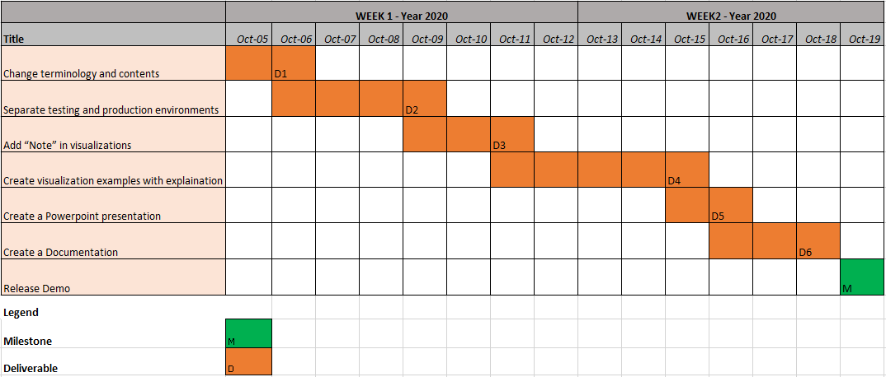

## My Wonder 

### Project Summary
MyWonder is a platform for big data analytics and visualization. It took long hours for users to create visualizations but now using MyWonder it can be done easily in under 10 minutes, even for large files. We distribute files on cloud which makes it really efficient. MyWonder can help users calculate their analytics and summaries from their phones before joining a meeting.

### Identified Wastes
**Waiting:**
 - A lot of time is spend by the CEO contacting the customer assistance team which takes time from his meetings with clients. 
 - A lot of time is also spent by the customer support talking to the designer and the designers talking to the developers.
   
**Over-Processing:**
 - The same questions are passed on amoung different individuals and teams multiple times. 
   
**Defects:**
 - Users don't understand terminologies like 'test visualization' which makes it inappropriate for demos
  
### Deliverables
- Change terminology and contents
- Separate testing and production environments
- Add “Note” in visualizations
- Create visualization examples with explaination
- Create a Powerpoint presentation
- Create a Documentation

### Milestones
- MyWonder demo release

### Gantt Diagram
  

